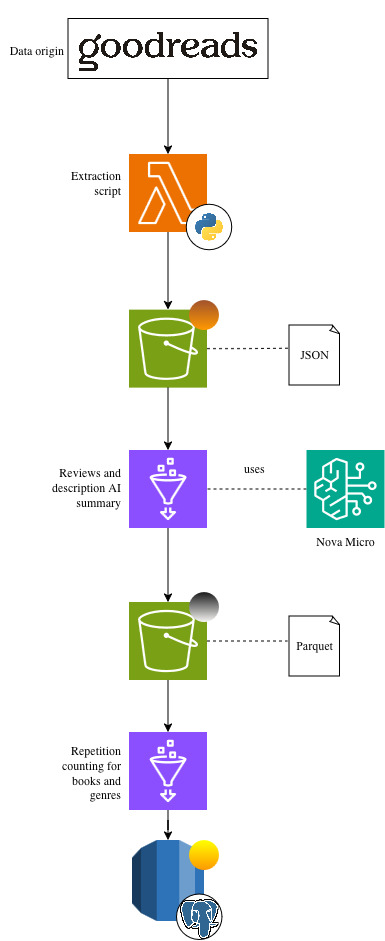
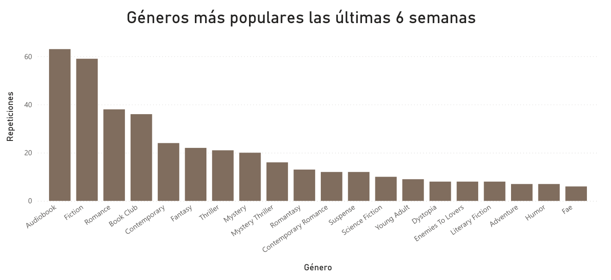

# data-engineering-popular-books-tracker

This data engineering project leverages AWS infrastructure to track trending books and genres over time. By ingesting and analyzing data from the [Goodreads Top 50 Most Read Books weekly list](https://www.goodreads.com/book/most_read), the system delivers actionable recommendations to optimize retail inventory and identify high-demand books to stock.



## Table of Contents

- [Architecture Overview](#architecture-overview)
- [Technology Stack](#technology-stack)
- [Data Pipeline](#data-pipeline)
- [Orchestration](#orchestration)
- [Project Structure](#project-structure)

## Architecture Overview

The project implements a **medallion architecture** (Bronze → Silver → Gold) on AWS, orchestrated via **AWS Step Functions**. The pipeline runs weekly to:

1. **Extract** book data from Goodreads using a Python scraper
2. **Store** raw JSON in S3 (Bronze layer)
3. **Enrich** data using Amazon Bedrock (Nova Lite model) for AI-generated summaries and descriptions (Silver layer)
4. **Aggregate** top books and genres over a 5-week rolling window (Gold layer in RDS PostgreSQL)
5. **Visualize** insights through Tableau dashboards

### Key Components

- **AWS Lambda**: Runs the web scraper and uploads raw data to S3
- **Amazon S3**: Data lake storage organized in Bronze/Silver layers
- **AWS Glue**: Executes PySpark ETL jobs for data transformation
- **Amazon Bedrock (Nova Lite)**: Generates Spanish descriptions and review summaries
- **AWS Glue Data Catalog**: Manages metadata for Silver layer tables
- **Amazon RDS (PostgreSQL)**: Stores aggregated Gold layer metrics
- **Amazon EventBridge**: Triggers weekly pipeline execution
- **AWS Step Functions**: Orchestrates the end-to-end pipeline execution
- **Tableau**: Business intelligence and visualization (planned)

## Technology Stack

| Layer | Technology | Purpose |
|-------|-----------|---------|
| **Data Extraction** | Python (BeautifulSoup, requests) | Web scraping |
| **Compute** | AWS Lambda, AWS Glue (PySpark) | Serverless execution |
| **Storage** | Amazon S3 (Parquet, JSON), Amazon RDS (PostgreSQL) | Data lake + relational DB |
| **AI/ML** | Amazon Bedrock (Nova Lite) | Text generation and summarization |
| **Orchestration** | AWS Step Functions, Amazon EventBridge | Workflow management and scheduling |
| **Cataloging** | AWS Glue Data Catalog | Metadata management |
| **Visualization** | Tableau | Dashboard and analytics |

## Data Pipeline

### 1. Bronze Layer: Raw Data Ingestion

- **Amazon EventBridge** triggers the Step Functions workflow weekly
- **AWS Step Functions** invokes the Lambda scraper function
- **AWS Lambda** executes the Goodreads scraper
- Extracts book metadata (title, author, rating, genres, publication date) and user reviews
- Stores raw JSON in S3: `s3://{BUCKET}/1bronze/year={YYYY}/week={WW}/{date}.json`

 **Setup Guide**: [`src/scraper/README.md`](src/scraper/README.md)

### 2. Silver Layer: Data Enrichment

- **AWS Step Functions** triggers the Bronze-to-Silver Glue job after Lambda completion
- **AWS Glue** job reads raw JSON from Bronze and flattens nested structures
- Invokes **Amazon Bedrock (Nova Lite)** to generate:
  - Spanish sentiment summaries from reviews (≤30 words)
  - Attractive Spanish descriptions from genres and metadata (≤50 words)
- Writes enriched Parquet files to S3 Silver layer
- Updates Glue Data Catalog with `book_data` and `book_appearances` tables

 **Setup Guide**: [`src/etl-jobs/README.md`](src/etl-jobs/README.md#bronze-to-silver)

### 3. Gold Layer: Business Metrics

- **AWS Glue** job analyzes last 5 weeks of data from Silver layer
- Computes **Top 10 books** by appearances and **Top 20 genres** by distinct books
- Inserts aggregated metrics into **RDS PostgreSQL** for reporting

 **Setup Guide**: [`src/etl-jobs/README.md`](src/etl-jobs/README.md#silver-to-gold)  
 **Database Schema**: [`src/etl-jobs/tables.sql`](src/etl-jobs/tables.sql)

## Orchestration

The pipeline is orchestrated using **AWS Step Functions**, which coordinates the execution of all three layers sequentially.

### Setting up Step Functions (via AWS Console)

1. **Navigate to Step Functions Console**
   - Go to AWS Console → Step Functions → State machines
   - Click **Create state machine**

2. **Choose Authoring Method**
   - Select **Write your workflow in code**
   - Choose **Standard** type

3. **Define the State Machine**
   
   In the definition editor, paste the following workflow:

   ```json
    {
    "StartAt": "Scrap books data",
    "States": {
        "Scrap books data": {
        "Type": "Task",
        "Resource": "arn:aws:states:::lambda:invoke",
        "Output": "",
        "Arguments": {
            "FunctionName": "<Your scraper Lambda arn>"
        },
        "Retry": [
            {
            "ErrorEquals": [
                "Lambda.ServiceException",
                "Lambda.AWSLambdaException",
                "Lambda.SdkClientException",
                "Lambda.TooManyRequestsException",
                "RuntimeError"
            ],
            "IntervalSeconds": 30,
            "MaxAttempts": 3,
            "BackoffRate": 2,
            "JitterStrategy": "FULL"
            }
        ],
        "Next": "bronze-to-silver"
        },
        "bronze-to-silver": {
        "Type": "Task",
        "Resource": "arn:aws:states:::glue:startJobRun.sync",
        "Arguments": {
            "JobName": "bronze-to-silver",
            "Arguments": {
            "--year": "",
            "--week": ""
            }
        },
        "End": true
        }
    },
    "QueryLanguage": "JSONata",
    "Comment": "Scrap information from goodreads and store it into S3"
    }
   ```

This definition will lead to a step function like the following:


   **Replace** `REGION` and `ACCOUNT_ID` with your AWS region and account ID.

4. **Configure Permissions**
   - Create or select an IAM role with permissions to:
     - Invoke Lambda function (`lambda:InvokeFunction`)
     - Start Glue jobs (`glue:StartJobRun`, `glue:GetJobRun`)
     - Write CloudWatch Logs

5. **Name and Create**
   - Name: `books-tracking-pipeline`
   - Review settings and click **Create state machine**

### Scheduling Weekly Execution

1. **Navigate to Amazon EventBridge**
   - Go to AWS Console → EventBridge → Rules
   - Click **Create rule**

2. **Configure Rule**
   - **Name**: `weekly-books-scraper`
   - **Rule type**: Schedule
   - **Schedule pattern**: Choose one of:
     - Cron expression: `cron(0 2 ? * MON *)` (Every Monday at 2:00 AM UTC)
     - Rate expression: `rate(7 days)`

3. **Select Target**
   - **Target type**: AWS service
   - **Select a target**: Step Functions state machine
   - **State machine**: Select `books-tracking-pipeline`
   - **Input**: Configure input (optional, can pass year/week parameters)

4. **Create Rule**
   - Review and create the EventBridge rule

The pipeline will now execute automatically every week, orchestrating all three layers in sequence.

---

**For detailed setup instructions** on individual components (Lambda, Glue jobs, RDS), see:
- 📁 [Scraper Setup](src/scraper/README.md#running-on-aws-lambda)
- 📁 [ETL Jobs Setup](src/etl-jobs/README.md)

## 📁 Project Structure

```
data-engineering-popular-books-tracker/
├── docs/
│   ├── architecture.jpg          # Architecture 
|   ├── graphics.png              # Graphics example
|   └── stepfunctions_graph.png   # Step function
├── src/
│   ├── scraper/
│   │   ├── scraper.py            # Goodreads scraper class
│   │   ├── lambda_function.py    # AWS Lambda handler
│   │   ├── pyproject.toml        # Python dependencies
│   │   ├── uv.lock               # Dependency lock file
│   │   └── README.md             # Scraper documentation
│   └── etl-jobs/
│       ├── bronze-to-silver.py   # Glue job: enrichment with Bedrock
│       ├── silver-to-gold.py     # Glue job: aggregations to RDS
│       ├── tables.sql            # PostgreSQL schema
│       └── README.md             # ETL jobs documentation
└── README.md                     # This file
```


## Data visualization
For visualizing data, gold layer records could be downloades as cvs and put into a BI tool. The following image is a graph of the most popular genres made in Power BI.



## Security Considerations

- **IAM Roles**: All services use IAM roles for authentication:
  - Lambda execution role with S3 write permissions
  - Glue service role with S3, Bedrock, and Glue Catalog permissions
  - Step Functions execution role with Lambda and Glue invoke permissions
- **RDS Access**: Glue jobs connect to RDS using standard PostgreSQL credentials within a VPC
- **VPC Configuration**: Glue jobs require VPC/subnet/security group settings to access RDS privately
- **S3 Security**: Bucket policies restrict access to authorized services only
- **IAM Best Practices**: All roles follow least-privilege principle
- **Cost Monitoring**: Nova Lite model usage is metered; monitor Bedrock costs in AWS Cost Explorer

**Future Enhancements**:
- Enable IAM database authentication for RDS
- Store connection strings in AWS Secrets Manager
- Implement S3 bucket encryption at rest (SSE-S3 or SSE-KMS)

## Notes

- The scraper respects Goodreads' public data and includes retry logic with exponential backoff
- AI-generated content is in Spanish; modify prompts in `bronze-to-silver.py` for other languages
- The pipeline is designed for weekly execution; adjust `CONTEO_SEMANAS` in `silver-to-gold.py` for different window sizes
- For detailed ETL job documentation, see individual README files in `src/scraper/` and `src/etl-jobs/`

## License

This project is for educational and research purposes only. Please review Goodreads' Terms of Service before scraping.

---

