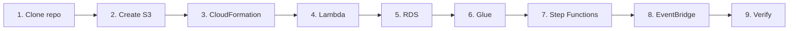

<div align="center">

# Popular Books Tracker

### Deployment Guide

**MISAMO inc.**


*This guide describes the complete process for replicating the project from scratch in a new AWS account.*

</div>

---

## Table of Contents

1. [Prerequisites](#prerequisites)
2. [Steps Overview](#steps-overview)
3. [Step 1 — Clone the Repository](#step-1-clone-the-repository)
4. [Step 2 — Create the S3 Bucket](#step-2-create-the-s3-bucket)
5. [Step 3 — Deploy with CloudFormation](#step-3-deploy-with-cloudformation-recommended)
6. [Step 4 — Create Lambda Layer and Function](#step-4-create-lambda-layer-and-function)
7. [Step 5 — Create RDS PostgreSQL](#step-5-create-rds-postgresql)
8. [Step 6 — Create Glue Data Catalog and Jobs](#step-6-create-glue-data-catalog-and-jobs)
9. [Step 7 — Create Step Functions State Machine](#step-7-create-step-functions-state-machine)
10. [Step 8 — Create EventBridge Rule](#step-8-create-eventbridge-rule)
11. [Step 9 — Verify the Deployment](#step-9-verify-the-deployment)
12. [Final Verification Checklist](#final-verification-checklist)
13. [Troubleshooting](#troubleshooting)

---

## Prerequisites

### Account and Tools

| | Requirement |
|:-:|:--|
| ☐ | Active **AWS account** with administrator permissions |
| ☐ | [**AWS CLI v2**](https://docs.aws.amazon.com/cli/latest/userguide/getting-started-install.html) installed and configured (`aws configure`) |
| ☐ | [**Python 3.13+**](https://www.python.org/downloads/) installed locally |
| ☐ | [**uv**](https://docs.astral.sh/uv/getting-started/installation/) installed (`curl -LsSf https://astral.sh/uv/install.sh \| sh`) |
| ☐ | **Git** to clone the repository |

### Required AWS Services

Verify the following services are enabled in your account in the target region (`us-east-2` recommended):

<table>
<tr>
<td>

- ☐ AWS Lambda
- ☐ Amazon S3
- ☐ AWS Glue
- ☐ Amazon Bedrock *(with **Amazon Nova Lite** access)*
- ☐ Amazon RDS

</td>
<td>

- ☐ AWS Step Functions
- ☐ Amazon EventBridge
- ☐ AWS IAM
- ☐ Amazon CloudWatch
- ☐ Amazon VPC *(available by default)*

</td>
</tr>
</table>

> [!IMPORTANT]
> To use Amazon Bedrock, model access must be requested from the console:
> **Bedrock → Model access → Amazon Nova Lite → Request access**

---

## Steps Overview



```
1. Clone the repository
2. Create S3 bucket (data lake)
3. Deploy infrastructure with CloudFormation (optional / recommended)
4. Create Lambda layer and function
5. Create RDS PostgreSQL and database schema
6. Create Glue Data Catalog and Jobs
7. Create Step Functions State Machine
8. Create EventBridge rule
9. Verify deployment with a test execution
```

---

## Step 1: Clone the Repository

```bash
git clone <repository-url>
cd data-engineering-popular-books-tracker
```

---

## Step 2: Create the S3 Bucket

```bash
# Replace BUCKET_NAME with a globally unique name
BUCKET_NAME="misamo-books-tracker-<account-id>"
REGION="us-east-2"

aws s3 mb s3://$BUCKET_NAME --region $REGION

# Block all public access
aws s3api put-public-access-block \
  --bucket $BUCKET_NAME \
  --public-access-block-configuration \
  "BlockPublicAcls=true,IgnorePublicAcls=true,BlockPublicPolicy=true,RestrictPublicBuckets=true"

echo "Bucket created: s3://$BUCKET_NAME"
```

---

## Step 3: Deploy with CloudFormation (Recommended)

Use the template at `iac/cloudformation.yaml` to create most resources automatically:

```bash
aws cloudformation deploy \
  --template-file iac/cloudformation.yaml \
  --stack-name popular-books-tracker \
  --parameter-overrides \
    ProjectName=popular-books-tracker \
    DataLakeBucketName=$BUCKET_NAME \
    BedrockModelId=amazon.nova-lite-v1:0 \
    RDSMasterUsername=booksadmin \
    RDSMasterPassword=<secure-password> \
    VpcId=<vpc-id> \
    SubnetId1=<subnet-id-1> \
    SubnetId2=<subnet-id-2> \
  --capabilities CAPABILITY_NAMED_IAM \
  --region $REGION
```

> [!NOTE]
> See `iac/cloudformation.yaml` for the full parameter list.
>
> If you prefer manual deployment, continue with steps 4 onward.

---

## Step 4: Create Lambda Layer and Function

### 4.1 Install dependencies into the layer folder

```bash
cd src/scraper

uv pip install \
  "beautifulsoup4==4.14.3" \
  "requests==2.33.0" \
  "tqdm==4.67.3" \
  --target layer/python/lib/python3.13/site-packages \
  --python-version 3.13 \
  --only-binary=:all:
```

### 4.2 Package the layer

```bash
cd layer && zip -r ../layer.zip . && cd ..
```

### 4.3 Publish the layer to Lambda

```bash
LAYER_ARN=$(aws lambda publish-layer-version \
  --layer-name "scraper-dependencies" \
  --zip-file fileb://layer.zip \
  --compatible-runtimes python3.13 \
  --compatible-architectures x86_64 \
  --region $REGION \
  --query 'LayerVersionArn' \
  --output text)

echo "Layer ARN: $LAYER_ARN"
```

### 4.4 Update the scraper configuration

Edit `src/scraper/lamda_function.py`, **line 13**:

```python
BUCKET = "misamo-books-tracker-<account-id>"  # Replace with the real bucket name
```

### 4.5 Package the function code

```bash
zip function.zip lambda_function.py scraper.py
```

> [!NOTE]
> The file is named `lamda_function.py` (single 'b') in the repository; the handler is `lamda_function.lambda_handler`.

### 4.6 Create the Lambda function

```bash
# Get the Lambda role ARN (created by CloudFormation or manually)
LAMBDA_ROLE_ARN="arn:aws:iam::<account-id>:role/LambdaScraperRole"

aws lambda create-function \
  --function-name books-scraper \
  --runtime python3.13 \
  --role $LAMBDA_ROLE_ARN \
  --handler lamda_function.lambda_handler \
  --zip-file fileb://function.zip \
  --timeout 180 \
  --memory-size 512 \
  --layers $LAYER_ARN \
  --region $REGION

echo "Lambda function created"
```

### 4.7 Create Lambda IAM role *(if CloudFormation was not used)*

<details>
<summary><strong>trust-policy-lambda.json</strong></summary>

```json
{
  "Version": "2012-10-17",
  "Statement": [{
    "Effect": "Allow",
    "Principal": {"Service": "lambda.amazonaws.com"},
    "Action": "sts:AssumeRole"
  }]
}
```

</details>

```bash
aws iam create-role \
  --role-name LambdaScraperRole \
  --assume-role-policy-document file://trust-policy-lambda.json

# Basic execution policy
aws iam attach-role-policy \
  --role-name LambdaScraperRole \
  --policy-arn arn:aws:iam::aws:policy/service-role/AWSLambdaBasicExecutionRole

# S3 write policy
aws iam put-role-policy \
  --role-name LambdaScraperRole \
  --policy-name S3BronzeWrite \
  --policy-document '{
    "Version":"2012-10-17",
    "Statement":[{
      "Effect":"Allow",
      "Action":["s3:PutObject","s3:GetObject"],
      "Resource":"arn:aws:s3:::'$BUCKET_NAME'/1bronze/*"
    }]
  }'
```

---

## Step 5: Create RDS PostgreSQL

### 5.1 Create RDS subnet group

```bash
aws rds create-db-subnet-group \
  --db-subnet-group-name books-tracker-subnet-group \
  --db-subnet-group-description "Subnet group for books tracker RDS" \
  --subnet-ids <subnet-id-1> <subnet-id-2> \
  --region $REGION
```

### 5.2 Create RDS instance

```bash
aws rds create-db-instance \
  --db-instance-identifier books-tracking-db \
  --db-instance-class db.t3.micro \
  --engine postgres \
  --engine-version 13.20 \
  --master-username booksadmin \
  --master-user-password <secure-password> \
  --db-name books_gold \
  --allocated-storage 20 \
  --db-subnet-group-name books-tracker-subnet-group \
  --no-publicly-accessible \
  --backup-retention-period 7 \
  --region $REGION

# Wait until RDS is available (~5-10 min)
aws rds wait db-instance-available \
  --db-instance-identifier books-tracking-db \
  --region $REGION

# Get endpoint
RDS_ENDPOINT=$(aws rds describe-db-instances \
  --db-instance-identifier books-tracking-db \
  --query 'DBInstances[0].Endpoint.Address' \
  --output text \
  --region $REGION)

echo "RDS Endpoint: $RDS_ENDPOINT"
```

### 5.3 Create database schema

```bash
psql -h $RDS_ENDPOINT -U booksadmin -d books_gold -f src/etl-jobs/tables.sql
```

---

## Step 6: Create Glue Data Catalog and Jobs

### 6.1 Upload Glue scripts to S3

```bash
aws s3 cp src/etl-jobs/bronze-to-silver.py s3://$BUCKET_NAME/scripts/bronze-to-silver.py
aws s3 cp src/etl-jobs/silver-to-gold.py s3://$BUCKET_NAME/scripts/silver-to-gold.py

echo "Scripts uploaded to S3"
```

### 6.2 Update variables in the scripts

Before uploading (or after editing in the Glue console):

**`bronze-to-silver.py`** *(lines 13 and 112)*:

```python
model_id = 'amazon.nova-lite-v1:0'
BUCKET = "s3://misamo-books-tracker-<account-id>"
```

**`silver-to-gold.py`** *(lines 27–31)*:

```python
RDS_HOST     = "<rds-endpoint>.rds.amazonaws.com"
RDS_PORT     = 5432
RDS_DB       = "books_gold"
RDS_USER     = "booksadmin"
RDS_PASSWORD = "<secure-password>"
```

### 6.3 Create Glue Catalog database

```bash
aws glue create-database \
  --database-input '{"Name":"db_books","Description":"Silver layer for books tracker"}' \
  --region $REGION
```

### 6.4 Create Glue Jobs

```bash
GLUE_ROLE_ARN="arn:aws:iam::<account-id>:role/GlueETLRole"

# bronze-to-silver job
aws glue create-job \
  --name bronze-to-silver \
  --role $GLUE_ROLE_ARN \
  --command '{"Name":"glueetl","ScriptLocation":"s3://'$BUCKET_NAME'/scripts/bronze-to-silver.py","PythonVersion":"3"}' \
  --glue-version "4.0" \
  --worker-type G.1X \
  --number-of-workers 2 \
  --timeout 60 \
  --default-arguments '{"--job-bookmark-option":"job-bookmark-disable","--BUCKET":"s3://'$BUCKET_NAME'","--model_id":"amazon.nova-lite-v1:0"}' \
  --region $REGION

# silver-to-gold job
aws glue create-job \
  --name silver-to-gold \
  --role $GLUE_ROLE_ARN \
  --command '{"Name":"glueetl","ScriptLocation":"s3://'$BUCKET_NAME'/scripts/silver-to-gold.py","PythonVersion":"3"}' \
  --glue-version "4.0" \
  --worker-type G.1X \
  --number-of-workers 2 \
  --timeout 30 \
  --region $REGION
```

### 6.5 Configure Glue Crawler *(for automatic Silver schema)*

```bash
aws glue create-crawler \
  --name silver-layer-crawler \
  --role $GLUE_ROLE_ARN \
  --database-name db_books \
  --targets '{"S3Targets":[{"Path":"s3://'$BUCKET_NAME'/2silver/book_data/"},{"Path":"s3://'$BUCKET_NAME'/2silver/book_appearances/"}]}' \
  --region $REGION
```

> [!TIP]
> Run the crawler manually after the first `bronze-to-silver` execution to register schemas in the catalog.

---

## Step 7: Create Step Functions State Machine

### 7.1 Get required ARNs

```bash
LAMBDA_ARN=$(aws lambda get-function \
  --function-name books-scraper \
  --query 'Configuration.FunctionArn' \
  --output text --region $REGION)

echo "Lambda ARN: $LAMBDA_ARN"
```

### 7.2 Create the State Machine

```bash
SF_ROLE_ARN="arn:aws:iam::<account-id>:role/StepFunctionsRole"

aws stepfunctions create-state-machine \
  --name books-tracking-pipeline \
  --definition '{
    "StartAt": "Scrap books data",
    "States": {
      "Scrap books data": {
        "Type": "Task",
        "Resource": "arn:aws:states:::lambda:invoke",
        "Output": "",
        "Arguments": {
          "FunctionName": "'$LAMBDA_ARN'"
        },
        "Retry": [{
          "ErrorEquals": ["Lambda.ServiceException","Lambda.AWSLambdaException","Lambda.SdkClientException","Lambda.TooManyRequestsException","RuntimeError"],
          "IntervalSeconds": 30,
          "MaxAttempts": 3,
          "BackoffRate": 2,
          "JitterStrategy": "FULL"
        }],
        "Next": "bronze-to-silver"
      },
      "bronze-to-silver": {
        "Type": "Task",
        "Resource": "arn:aws:states:::glue:startJobRun.sync",
        "Arguments": {
          "JobName": "bronze-to-silver",
          "Arguments": {
            "--year": "",
            "--week": ""
          }
        },
        "End": true
      }
    },
    "QueryLanguage": "JSONata",
    "Comment": "Scrap information from goodreads and store it into S3"
  }' \
  --role-arn $SF_ROLE_ARN \
  --type STANDARD \
  --region $REGION

echo "State Machine created"
```

---

## Step 8: Create EventBridge Rule

```bash
SF_ARN=$(aws stepfunctions list-state-machines \
  --query 'stateMachines[?name==`books-tracking-pipeline`].stateMachineArn' \
  --output text --region $REGION)

EB_ROLE_ARN="arn:aws:iam::<account-id>:role/EventBridgeRole"

# Create weekly schedule rule (Monday 00:00 UTC = Sunday 18:00 GMT-6)
aws events put-rule \
  --name weekly-books-scraper \
  --schedule-expression "cron(0 18 ? * SUN *)" \
  --state ENABLED \
  --description "Triggers the books pipeline weekly" \
  --region $REGION

# Associate Step Functions as target
aws events put-targets \
  --rule weekly-books-scraper \
  --targets '[{
    "Id": "StepFunctionsTarget",
    "Arn": "'$SF_ARN'",
    "RoleArn": "'$EB_ROLE_ARN'"
  }]' \
  --region $REGION

echo "EventBridge rule created"
```

---

## Step 9: Verify the Deployment

### 9.1 Trigger the pipeline manually

```bash
SF_ARN=$(aws stepfunctions list-state-machines \
  --query 'stateMachines[?name==`books-tracking-pipeline`].stateMachineArn' \
  --output text --region $REGION)

EXECUTION_ARN=$(aws stepfunctions start-execution \
  --state-machine-arn $SF_ARN \
  --region $REGION \
  --query 'executionArn' --output text)

echo "Execution started: $EXECUTION_ARN"
```

### 9.2 Monitor the execution

```bash
# Check status (repeat until status is SUCCEEDED or FAILED)
aws stepfunctions describe-execution \
  --execution-arn $EXECUTION_ARN \
  --query '{status:status, startDate:startDate}' \
  --region $REGION
```

### 9.3 Verify data in S3 Bronze

```bash
aws s3 ls s3://$BUCKET_NAME/1bronze/ --recursive
```

### 9.4 Run the Glue Crawler *(to register Silver schemas)*

```bash
aws glue start-crawler --name silver-layer-crawler --region $REGION

# Check crawler state
aws glue get-crawler \
  --name silver-layer-crawler \
  --query 'Crawler.State' \
  --region $REGION
```

### 9.5 Run the Silver → Gold job

```bash
RUN_ID=$(aws glue start-job-run \
  --job-name silver-to-gold \
  --region $REGION \
  --query 'JobRunId' --output text)

# Monitor status
aws glue get-job-run \
  --job-name silver-to-gold \
  --run-id $RUN_ID \
  --query '{status:JobRun.JobRunState,message:JobRun.ErrorMessage}' \
  --region $REGION
```

### 9.6 Verify data in RDS Gold

```bash
psql -h $RDS_ENDPOINT -U booksadmin -d books_gold -c \
  "SELECT m.fecha_registro, m.conteo_semanas, COUNT(l.id) AS books, COUNT(g.id) AS genres
   FROM metadata_repeticiones m
   LEFT JOIN repeticiones_libros l ON l.id_metadata = m.id_metadata
   LEFT JOIN repeticiones_generos g ON g.id_metadata = m.id_metadata
   GROUP BY m.id_metadata;"
```

---

## Final Verification Checklist

<table>
<tr><td>

- [ ] S3 bucket created and public access blocked
- [ ] Lambda `books-scraper` deployed with dependencies layer
- [ ] Lambda returns `{"statusCode": 200, "year": "...", "week": "..."}` on manual test
- [ ] JSON file visible in `s3://{bucket}/1bronze/`
- [ ] Glue job `bronze-to-silver` executes without errors
- [ ] Parquet files visible in `s3://{bucket}/2silver/`

</td><td>

- [ ] Glue Crawler updates the catalog with `book_data` and `book_appearances` tables
- [ ] Glue job `silver-to-gold` executes without errors
- [ ] Data visible in RDS: `SELECT * FROM metadata_repeticiones;`
- [ ] Step Functions State Machine runs the full pipeline end-to-end
- [ ] EventBridge rule enabled and pointing to Step Functions

</td></tr>
</table>

---

## Troubleshooting

| Issue | Likely Cause | Solution |
|:--|:--|:--|
| **Lambda:** `NoCredentialsError` | IAM role missing S3 permissions | Verify `S3BronzeWrite` policy on `LambdaScraperRole` |
| **Glue:** `AccessDeniedException` Bedrock | Missing `bedrock:InvokeModel` permission | Add permission to `GlueETLRole` and verify model access in Bedrock console |
| **Glue:** `AnalysisException` Silver | Crawler not yet executed | Run `silver-layer-crawler` after first Bronze→Silver execution |
| **Glue silver-to-gold:** `psycopg2.OperationalError` | Glue cannot reach RDS | Verify Glue job VPC/subnet/security group; port `5432` must be open |
| **Step Functions:** `FAILED` state | Lambda or Glue failure | Check CloudWatch Logs for the specific component |
| **EventBridge:** not triggering | Rule disabled or no target | Verify rule state and that the target has a role with `states:StartExecution` |

---

<div align="center">

*Document prepared by **MISAMO inc.** — Internal use only*

</div>
