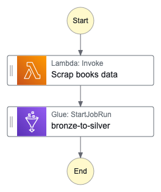

# Architecture Documentation
## Data Lake Implementation for Tracking Popular Books and Genres

**Version**: 1.0  
**Date**: 2026-05-24  
**Document**: Architecture  
**Organization**: MISAMO inc.

---

## 1. Executive Summary

This document describes the technical data architecture implemented with AWS for MISAMO inc. The primary objective is to provide a clear view of the data flow through the solution — from the most basic layer where data is ingested from the source (Goodreads), to the most refined layer where it is consumed through business visualization tools.

The solution is based on a **medallion architecture** (Bronze → Silver → Gold), where data is organized into three layers with increasing levels of transformation. AWS infrastructure was chosen for its versatility (auto-scaling, zero server management), pay-per-use model, and lower cost compared to on-premise solutions.

---

## 2. Architecture Diagram


**General flow**:
```
Goodreads (Source)
      │
      ▼
 AWS Lambda (Python extraction)
      │
      ▼
Amazon S3 [Bronze] ──── JSON
      │
      ▼
 AWS Glue Job (Bronze→Silver)
      │ uses
      ├──── Amazon Bedrock Nova Lite (generative AI)
      │
      ▼
Amazon S3 [Silver] ──── Parquet
      │               ──── Glue Data Catalog
      │
      ▼
 AWS Glue Job (Silver→Gold)
      │
      ▼
Amazon RDS PostgreSQL [Gold]
      │
      ▼
 Tableau / Power BI (Visualization)
```

---

## 3. Medallion Architecture

The medallion architecture is a standard data lake design pattern that organizes data into progressive layers of quality and transformation.

### 3.1 Bronze Layer — Raw Data

| Attribute | Value |
|-----------|-------|
| **Purpose** | Persist data exactly as received from the source, without transformation |
| **Technology** | Amazon S3 (JSON) |
| **Update frequency** | Weekly (every Sunday) |
| **Path** | `s3://{bucket}/1bronze/year={YYYY}/week={WW}/{date}.json` |
| **Content** | Book metadata + full reviews with like counts |
| **Retention** | Indefinite (complete historical record) |

The Bronze layer serves as the **source of truth** for the pipeline. If any downstream transformation fails, the raw data is always available for reprocessing.

### 3.2 Silver Layer — Curated and Enriched Data

| Attribute | Value |
|-----------|-------|
| **Purpose** | Clean, AI-enriched data ready for analysis |
| **Technology** | Amazon S3 (Parquet) + AWS Glue Data Catalog |
| **Update frequency** | Weekly, after Bronze |
| **Paths** | `s3://{bucket}/2silver/book_data/` and `s3://{bucket}/2silver/book_appearances/` |
| **Content** | Book metadata + AI review summary + AI description |
| **Format** | Parquet (columnar, compressed, efficient for analytical queries) |

The Silver layer splits information into **two tables** to optimize storage:
- `book_data`: book data stored **only once** (first appearance) — SCD-0 dimension.
- `book_appearances`: lightweight record of each weekly appearance (only `id`, `year`, `week`) — fact table.

### 3.3 Gold Layer — Business Metrics

| Attribute | Value |
|-----------|-------|
| **Purpose** | Answer business questions with pre-aggregated data |
| **Technology** | Amazon RDS (PostgreSQL) |
| **Update frequency** | On-demand (manual or analyst-scheduled) |
| **Content** | Top 10 books and Top 20 genres for a 5-week window |
| **Access** | BI tools via JDBC/ODBC (Tableau, Power BI) |

The Gold layer is consumed by the **business end user**. The relational schema enables direct SQL queries and connection to standard visualization tools.

---

## 4. Infrastructure Components

### 4.1 AWS Lambda — Extraction

- **Runtime**: Python 3.13
- **Timeout**: 3 minutes
- **Memory**: 512 MB
- **Trigger**: AWS Step Functions
- **Layer**: Python dependencies (BeautifulSoup4, requests, tqdm)
- **IAM Role**: S3 Bronze write + CloudWatch Logs

The Lambda function is stateless and runs ephemerally. It writes to `/tmp` (ephemeral storage) before uploading to S3.

### 4.2 Amazon S3 — Data Lake Storage

- **Single bucket** with prefixes to organize layers.
- Hierarchical structure partitioned by `year` and `week` for read efficiency.
- No public exposure; access controlled exclusively via IAM roles.

### 4.3 AWS Glue — ETL and Catalog

**AWS Glue Jobs** (PySpark):
- `bronze-to-silver`: Reads JSON, invokes Bedrock, writes Parquet to Silver.
- `silver-to-gold`: Reads Silver from the Glue Catalog, aggregates metrics, writes to RDS.

**AWS Glue Data Catalog**:
- Database: `db_books`
- Tables: `book_data`, `book_appearances`
- Allows the `silver-to-gold` job to query Silver as if it were SQL, with a typed schema.

### 4.4 Amazon Bedrock — Artificial Intelligence

- **Model**: Amazon Nova Lite (`amazon.nova-lite-v1:0`)
- **Region**: `us-east-2`
- **Usage**: Text generation (inference) — two calls per new book:
  1. Review sentiment summary (≤ 30 words, Spanish)
  2. Attractive commercial description (≤ 50 words, Spanish)
- **Cost**: Token-based billing; Nova Lite is the most economical model in the Nova family.

### 4.5 Amazon RDS — Gold Database

- **Engine**: PostgreSQL 13+
- **Identifier**: `books-tracking-db`
- **Database**: `books_gold`
- **Access**: Private, within the VPC; not exposed to the internet.
- **Glue connectivity**: The `silver-to-gold` job runs in the same VPC and subnet.

### 4.6 AWS Step Functions — Orchestration

- **Type**: Standard (supports long-running executions)
- **Language**: JSONata (for data transformation expressions between states)
- **States**: 2 (Lambda task → Glue task)
- **Error handling**: Retry policy with exponential backoff on the Lambda step.
- **Flow diagram**:



### 4.7 Amazon EventBridge — Scheduling

- **Rule**: `weekly-books-scraper`
- **Type**: Schedule (cron)
- **Expression**: `cron(0 0 ? * MON *)` → Monday 00:00 UTC (≈ Sunday 18:00 GMT-6)
- **Target**: Step Functions `books-tracking-pipeline`

---

## 5. Detailed Data Flow

```
[1] EventBridge triggers Step Functions (Monday 00:00 UTC)
        │
        ▼
[2] Step Functions → invokes Lambda "Scrap books data"
        │
        ▼
[3] Lambda executes most_read_scraper.scrape()
    - GET https://www.goodreads.com/book/most_read → list of URLs
    - For each book: GET book URL → metadata + reviews
    - Serializes to JSON, writes to /tmp/{date}.json
        │
        ▼
[4] Lambda uploads file to S3:
    s3://{bucket}/1bronze/year={YYYY}/week={WW}/{date}.json
    Returns → {"year": "2026", "week": "21"}
        │
        ▼
[5] Step Functions → invokes Glue job "bronze-to-silver"
    with arguments --year=2026 --week=21
        │
        ▼
[6] Glue reads JSON from S3 Bronze
    - Flattens nested structure (book.* + reviews)
    - Anti-join with existing book_data (avoids duplicates)
    - For each NEW book:
        ├── UDF sumarize_reviews → Bedrock → Spanish summary
        └── UDF generate_description → Bedrock → Spanish description
        │
        ▼
[7] Glue writes to S3 Silver (append):
    - book_data/part-*.parquet  (new books only, enriched)
    - book_appearances/part-*.parquet  (all books: id, year, week)
        │
        ▼
[8] (On-demand) Analyst executes Glue job "silver-to-gold"
    - Reads book_appearances and book_data from Glue Catalog
    - Filters last 5 ISO weeks
    - Calculates Top 10 books (by appearances)
    - Calculates Top 20 genres (by distinct books, LATERAL VIEW EXPLODE)
        │
        ▼
[9] Glue inserts into RDS PostgreSQL:
    - metadata_repeticiones (date, window)
    - repeticiones_libros (FK to metadata)
    - repeticiones_generos (FK to metadata)
        │
        ▼
[10] BI Tool (Tableau/Power BI) connects to RDS via JDBC
     and visualizes the results
```

---

## 6. Design Decisions

### Why medallion architecture?
It enables reprocessing at any level (if Silver fails, it can be relaunched from Bronze), facilitates data auditing, and separates concerns between layers.

### Why serverless (Lambda + Glue)?
Eliminates server management, reduces baseline cost to zero when idle, and scales automatically. A weekly volume of ~50 books does not justify a permanent cluster.

### Why Parquet in Silver?
Columnar format with native compression. Optimized for reading column subsets, which speeds up analytical queries in the Silver→Gold job and reduces S3 transfer costs.

### Why two Silver tables (book_data + book_appearances)?
Avoids duplicating enriched metadata (and the Bedrock cost) every week. `book_data` is an SCD-0 dimension (immutable), while `book_appearances` is the weekly appearance fact table.

### Why RDS PostgreSQL for Gold?
Gold layer data is a small, pre-aggregated result (Top 10 + Top 20). A relational database is the simplest, most economical option and is compatible with standard BI tools.

### Why Amazon Bedrock Nova Lite?
It is the lowest-cost model in Amazon's Nova family, with sufficient capability for short text generation (≤ 50 words). Accessible directly from the AWS VPC without exposing data externally.

---

## 7. Technology Stack Summary

| Technology | Purpose |
|-----------|---------|
| Python (BeautifulSoup, requests) | Web scraping and data ingestion |
| AWS Lambda | Serverless scraper execution |
| AWS Glue (PySpark) | Serverless ETL |
| Amazon S3 | Data lake storage (Bronze + Silver) |
| Amazon Bedrock (Nova Lite) | Spanish-language summaries and descriptions |
| AWS Glue Data Catalog | Metadata catalog and schema management |
| Amazon RDS (PostgreSQL) | Relational storage for the Gold layer |
| AWS Step Functions | Pipeline orchestration |
| Amazon EventBridge | Weekly pipeline scheduling |
| Tableau / Power BI | Business visualization and analytics |

---

## 8. Security Considerations and Future Improvements

| Area | Current state | Recommended improvement |
|------|--------------|------------------------|
| RDS credentials | Hardcoded in source code | AWS Secrets Manager |
| S3 encryption | No explicit configuration | SSE-S3 or SSE-KMS |
| RDS authentication | Traditional username/password | IAM Database Authentication |
| VPC endpoints | No private endpoints | VPC Endpoints for S3 and Glue |
| Monitoring | Basic CloudWatch Logs | CloudWatch Alarms + SNS notifications |

---

*Document prepared by MISAMO inc. — Date: 19-05-2026*
